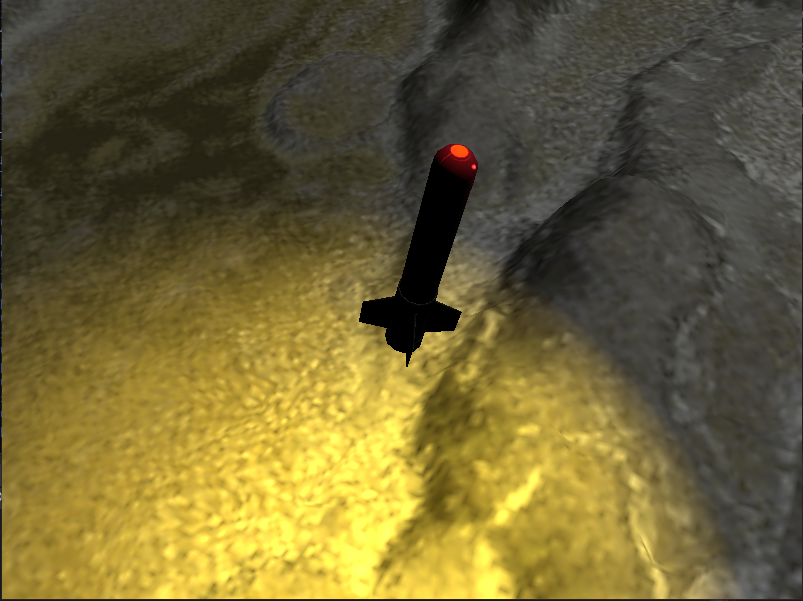

# Missile Simulator
Design a simulator of a point-to-point missile in a 3D landscape. The point of view must be in third-person. The
missile must follow a parabolic-like trajectory and its orientation must be interpolated accordingly

## Features
- Missile parabolic trajectory simulation
- Third person camera that rotates around the missile
- Topdown aim mode to move missle destination
- Simple terrain collision detection
- Skybox
- Two render pipelines, lit (global lights) + unlit
- Global direction light
- Hemispheric ambient light
- Spot light that emulates the missile engine lighting
- Animated point light that emulates a navigation light on top of the missile

## Controls
Buttons | Action
--- | --- 
Arrow Up/Down/Left/Right | Rotate around missile/Move missile destination in aim mode
Mouse 1 + Mouse Drag |  Rotate around missile
M | Toggle aim mode
Space | Start/Reset simulation

## Compile
- Install vulkan
- Open `CMakeLists` in Visual Studio and compile from the IDE (you need VisualC++ installed)

## Asset Credits

- [Terrain by falk lochmann](https://sketchfab.com/3d-models/terrain-alpine-2-5a7350f8029f48b1b39e9bde295a8077)
- [Missile by Sabri Ayeş](https://sketchfab.com/3d-models/missile-blue-for-unity-5-ee8a8689eb68452d8b9dff98606df868)
- [Skybox by fangzhangmnm](https://sketchfab.com/3d-models/anime-starry-night-db0952ccd1ee4c77a1a07709b3d4f4f0)

## Gallery

